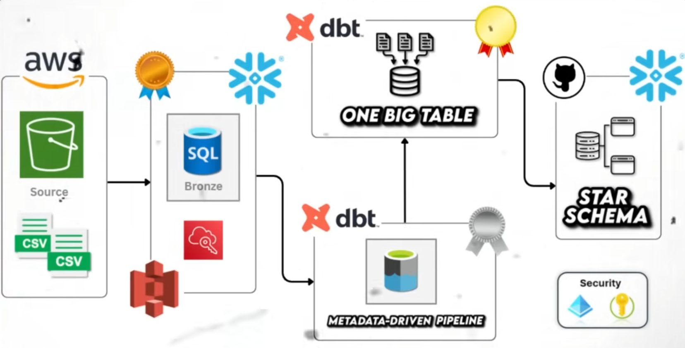

# 🏠 Airbnb End-to-End Data Engineering Project



## 📋 Overview

This project implements a complete end-to-end data engineering pipeline for Airbnb data using modern cloud technologies. The solution demonstrates best practices in data warehousing, transformation, and analytics using **Snowflake**, **dbt (Data Build Tool)**, and **AWS**.

The pipeline processes Airbnb listings, bookings, and hosts data through a medallion architecture (Bronze → Silver → Gold), implementing incremental loading, slowly changing dimensions (SCD Type 2), and creating analytics-ready datasets.

## 🏗️ Architecture

### Data Flow
```
Source Data (CSV) → AWS S3 → Snowflake (Staging) → Bronze Layer → Silver Layer → Gold Layer
                                                           ↓              ↓           ↓
                                                      Raw Tables    Cleaned Data   Analytics
```

### Technology Stack

- **Cloud Data Warehouse**: Snowflake
- **Transformation Layer**: dbt (Data Build Tool)
- **Cloud Storage**: AWS S3 (implied)
- **Version Control**: Git
- **Python**: 3.12+
- **Key dbt Features**:
  - Incremental models
  - Snapshots (SCD Type 2)
  - Custom macros
  - Jinja templating
  - Testing and documentation

## 📊 Data Model

### Medallion Architecture

#### 🥉 Bronze Layer (Raw Data)
Raw data ingested from staging with minimal transformations:
- `bronze_bookings` - Raw booking transactions
- `bronze_hosts` - Raw host information
- `bronze_listings` - Raw property listings

#### 🥈 Silver Layer (Cleaned Data)
Cleaned and standardized data:
- `silver_bookings` - Validated booking records
- `silver_hosts` - Enhanced host profiles with quality metrics
- `silver_listings` - Standardized listing information with price categorization

#### 🥇 Gold Layer (Analytics-Ready)
Business-ready datasets optimized for analytics:
- `obt` (One Big Table) - Denormalized fact table joining bookings, listings, and hosts
- `fact` - Fact table for dimensional modeling
- Ephemeral models for intermediate transformations

### Snapshots (SCD Type 2)
Slowly Changing Dimensions to track historical changes:
- `dim_bookings` - Historical booking changes
- `dim_hosts` - Historical host profile changes
- `dim_listings` - Historical listing changes

## 📁 Project Structure

```
AWS_DBT_Snowflake/
├── README.md                           # This file
├── pyproject.toml                      # Python dependencies
├── main.py                             # Main execution script
│
├── SourceData/                         # Raw CSV data files
│   ├── bookings.csv
│   ├── hosts.csv
│   └── listings.csv
│
├── DDL/                                # Database schema definitions
│   ├── ddl.sql                         # Table creation scripts
│   └── resources.sql
│
└── aws_dbt_snowflake_project/         # Main dbt project
    ├── dbt_project.yml                 # dbt project configuration
    ├── ExampleProfiles.yml             # Snowflake connection profile
    │
    ├── models/                         # dbt models
    │   ├── sources/
    │   │   └── sources.yml             # Source definitions
    │   ├── bronze/                     # Raw data layer
    │   │   ├── bronze_bookings.sql
    │   │   ├── bronze_hosts.sql
    │   │   └── bronze_listings.sql
    │   ├── silver/                     # Cleaned data layer
    │   │   ├── silver_bookings.sql
    │   │   ├── silver_hosts.sql
    │   │   └── silver_listings.sql
    │   └── gold/                       # Analytics layer
    │       ├── fact.sql
    │       ├── obt.sql
    │       └── ephemeral/              # Temporary models
    │           ├── bookings.sql
    │           ├── hosts.sql
    │           └── listings.sql
    │
    ├── macros/                         # Reusable SQL functions
    │   ├── generate_schema_name.sql    # Custom schema naming
    │   ├── multiply.sql                # Math operations
    │   ├── tag.sql                     # Categorization logic
    │   └── trimmer.sql                 # String utilities
    │
    ├── analyses/                       # Ad-hoc analysis queries
    │   ├── explore.sql
    │   ├── if_else.sql
    │   └── loop.sql
    │
    ├── snapshots/                      # SCD Type 2 configurations
    │   ├── dim_bookings.yml
    │   ├── dim_hosts.yml
    │   └── dim_listings.yml
    │
    ├── tests/                          # Data quality tests
    │   └── source_tests.sql
    │
    └── seeds/                          # Static reference data
```

## 🚀 Getting Started

### Prerequisites

1. **Snowflake Account (will create one if doesn't exist)**

2. **Python Environment**
   - Python 3.12 or higher
   - pip or uv package manager

3. **AWS Account (will create one if doesn't exist) ** (for S3 storage)

### Installation

1. **Clone the Repository**
   ```bash
   git clone <repository-url>
   cd AWS_DBT_Snowflake
   ```

2. **Create Virtual Environment**
   ```bash
   python -m venv .venv
   .venv\Scripts\Activate.ps1  # Windows PowerShell
   # or
   source .venv/bin/activate    # Linux/Mac
   ```

3. **Install Dependencies**
   ```bash
   pip install -r requirements.txt
   # or using pyproject.toml
   pip install -e .
   ```

   **Core Dependencies:**
   - `dbt-core>=1.11.2`
   - `dbt-snowflake>=1.11.0`
   - `sqlfmt>=0.0.3`

4. **Configure Snowflake Connection**
   
   Create `~/.dbt/profiles.yml`:
   ```yaml
   aws_dbt_snowflake_project:
     outputs:
       dev:
         account: <your-account-identifier>
         database: AIRBNB
         password: <your-password>
         role: ACCOUNTADMIN
         schema: dbt_schema
         threads: 4
         type: snowflake
         user: <your-username>
         warehouse: COMPUTE_WH
     target: dev
   ```

5. **Set Up Snowflake Database**
   
   Run the DDL scripts to create tables:
   ```bash
   # Execute DDL/ddl.sql in Snowflake to create staging tables
   ```

6. **Load Source Data**
   
   Load CSV files from `SourceData/` to Snowflake staging schema:
   - `bookings.csv` → `AIRBNB.STAGING.BOOKINGS`
   - `hosts.csv` → `AIRBNB.STAGING.HOSTS`
   - `listings.csv` → `AIRBNB.STAGING.LISTINGS`

## 🔧 Usage

### Running dbt Commands

1. **Test Connection**
   ```bash
   cd aws_dbt_snowflake_project
   dbt debug
   ```

2. **Install Dependencies**
   ```bash
   dbt deps
   ```

3. **Run All Models**
   ```bash
   dbt run
   ```